# 🚀 Customer Churn Prediction MLOps Pipeline


---

# Table of Contents

* [Project Overview](#project-overview)
* [Key Features](#key-features)
* [Demo](#demo)
* [System Architecture](#system-architecture)
* [Repository Structure](#repository-structure)
* [Project Documentation](#project-documentation)
* [Technology Stack](#technology-stack)
* [Dataset](#dataset)
* [Model Performance](#model-performance)
* [Installation](#installation)
* [Local Development](#local-development)
* [Docker Deployment](#docker-deployment)
* [Kubernetes Deployment](#kubernetes-deployment)
* [Monitoring](#monitoring)
* [REST API](#rest-api)
* [Automated Retraining Pipeline](#automated-retraining-pipeline)
* [CI/CD Pipeline](#cicd-pipeline)
* [Project Workflow](#project-workflow)
* [Screenshots](#screenshots)
* [Future Improvements](#future-improvements)
* [Contributing](#contributing)
* [License](#license)
* [Author](#author)

---

# Project Overview

This project demonstrates an end-to-end **production-ready Machine Learning Operations (MLOps) pipeline** for customer churn prediction.

Unlike a traditional machine learning project, this repository implements the complete lifecycle of a production ML system, including:

* Data preprocessing
* Feature engineering
* Model training
* Model comparison
* Automated artifact management
* FastAPI model serving
* Docker containerization
* Kubernetes deployment
* Prometheus monitoring
* Grafana dashboards
* Data drift detection
* Automated retraining
* GitHub Actions CI/CD

The objective is to simulate how machine learning models are developed, deployed, monitored, and continuously improved in a real production environment.

---

# Key Features

✅ End-to-End MLOps Pipeline

✅ Automated Feature Engineering

✅ Multi-model Training

* Logistic Regression
* Random Forest
* Gradient Boosting
* XGBoost

✅ Automatic Best Model Selection

✅ Production Model Comparison

✅ Automatic Artifact Versioning

✅ FastAPI REST API

✅ Dockerized Application

✅ Kubernetes Deployment

✅ Prometheus Metrics

✅ Grafana Dashboard

✅ Data Drift Monitoring

✅ Automated Retraining Pipeline

✅ GitHub Actions CI

✅ Automated CD Trigger after Successful Retraining

---

# Demo

## API Demo

### Health Endpoint

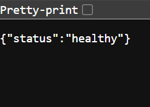

---

### API Call

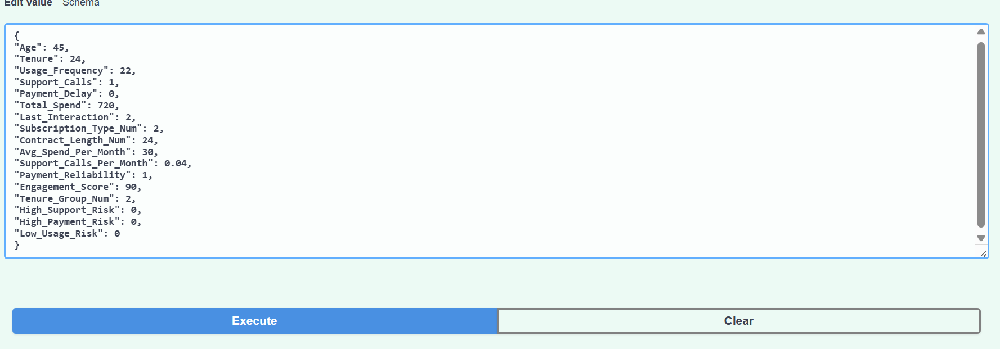

### Prediction Request

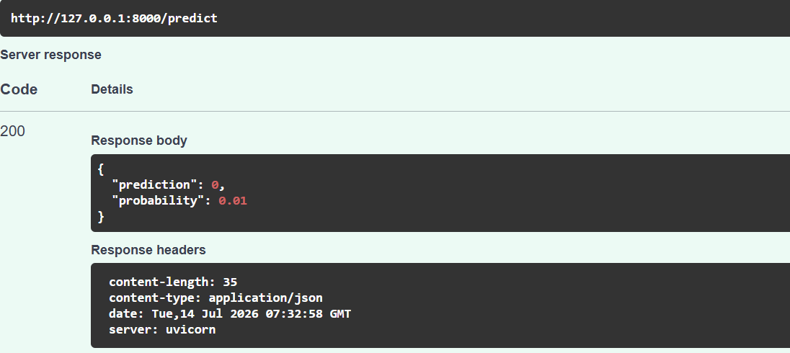

---
## 📊 Monitoring

### Prometheus Metrics

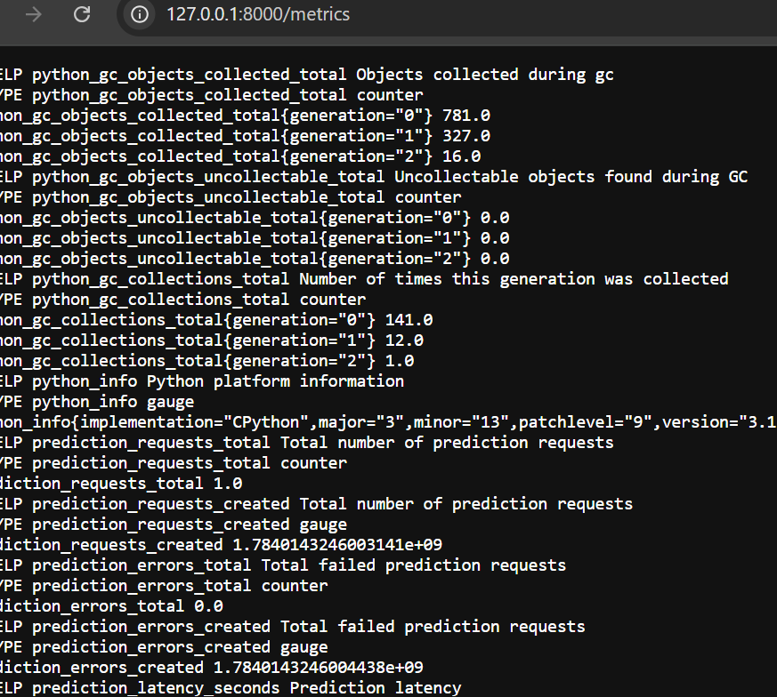

---

### Additional Metrics

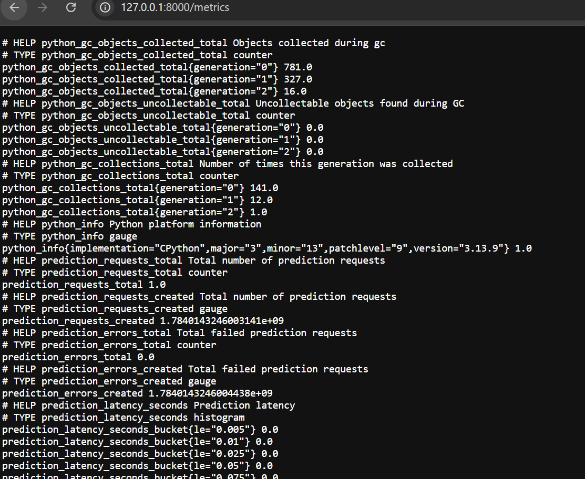

---

### Prometheus Target

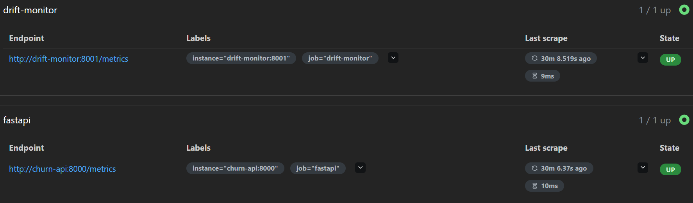

---
## 📈 Grafana Dashboard

### Dashboard Overview

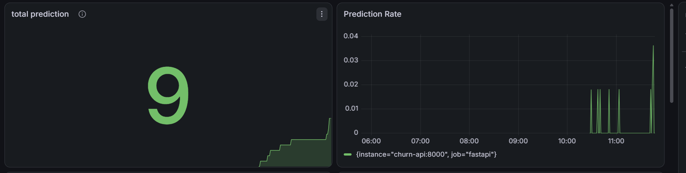

---

### Prediction Metrics

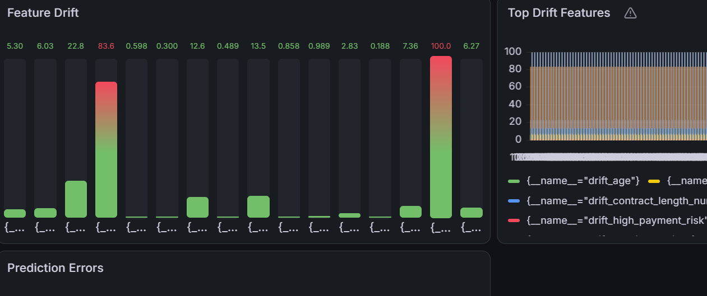

---

### Drift Monitoring

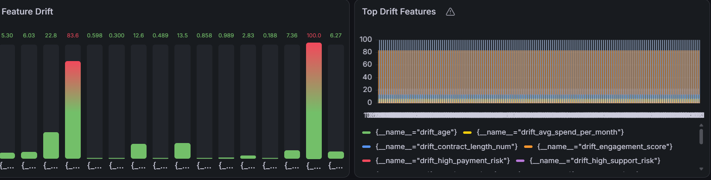


# System Architecture

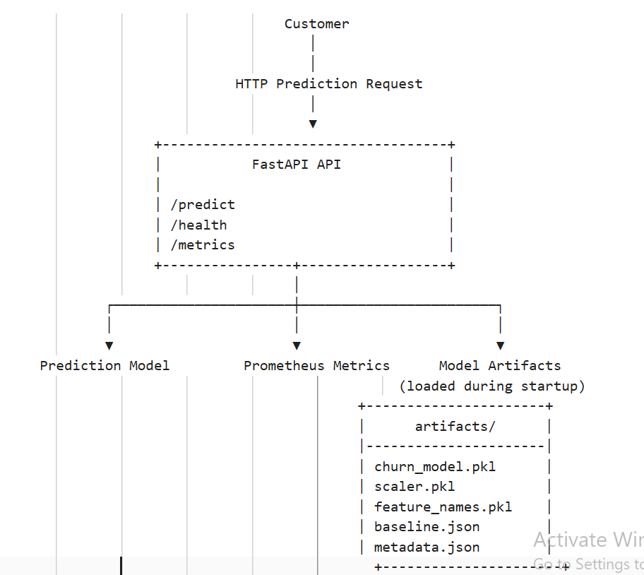
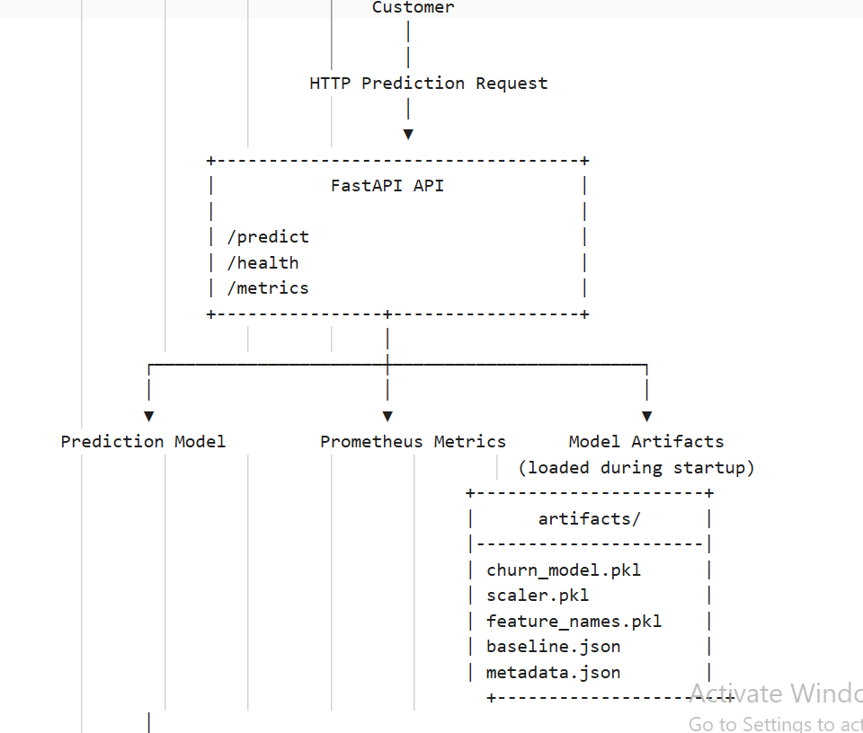


---
# Kubernetes Services
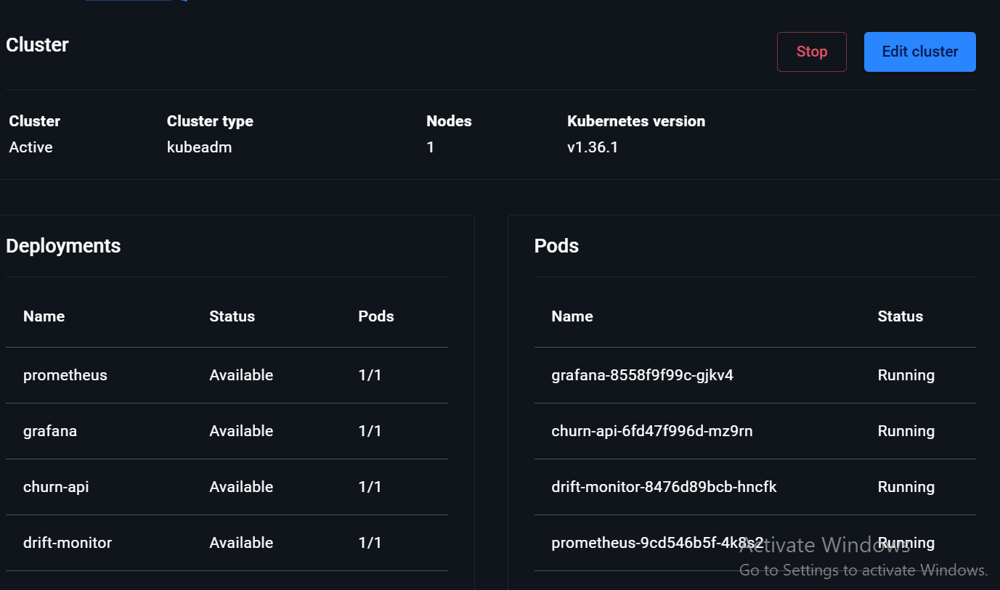
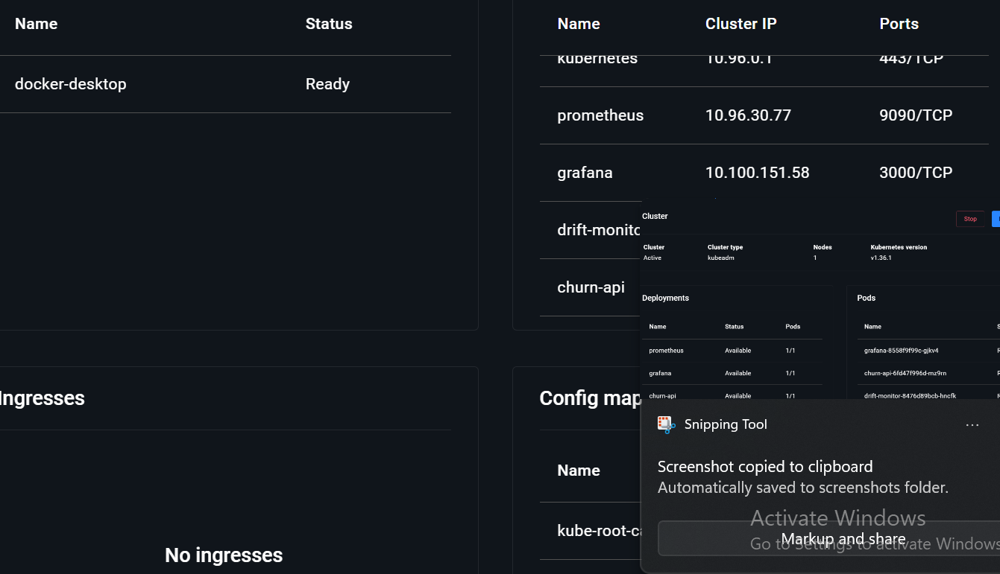
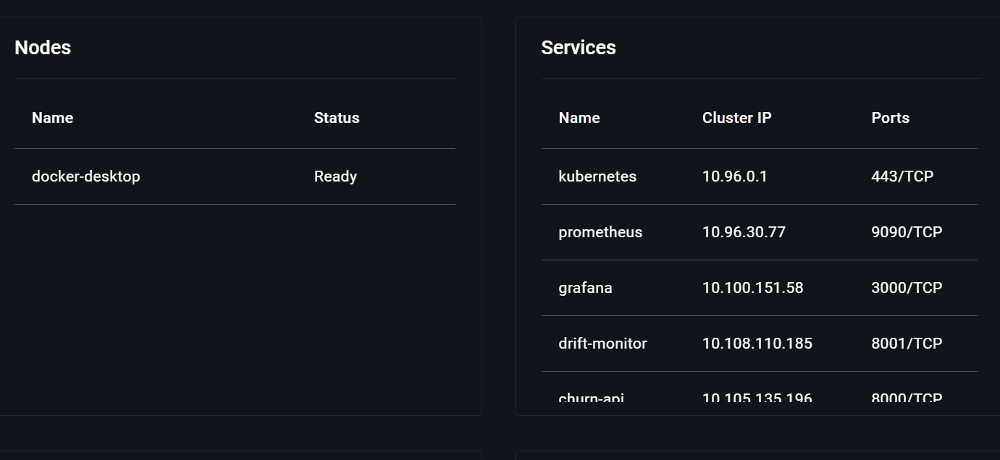
---
# Docker Services

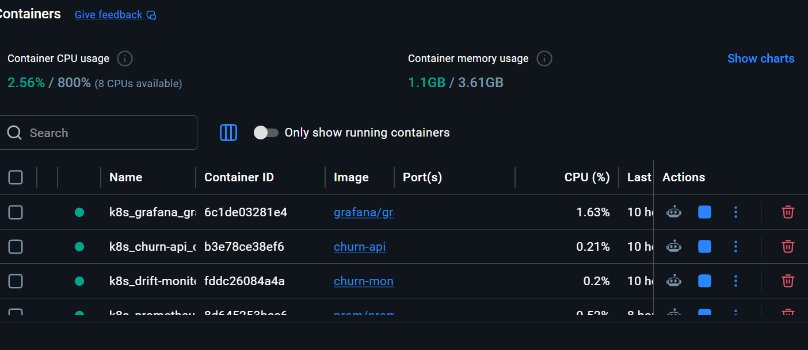
---
# Repository Structure

```text
Customer_Churn_MLOps/
│
├── app.py
├── train.py
├── monitor.py
├── requirements.txt
├── Dockerfile
├── Dockerfile.monitor
├── docker-compose.yml
├── prometheus.yml
│
├── artifacts/
│   ├── churn_model.pkl
│   ├── scaler.pkl
│   ├── feature_names.pkl
│   ├── baseline.json
│   └── metadata.json
│
├── automation/
│
├── retraining/
│
├── tests/
│
├── k8s/
│
├── docs/
│
├── .github/
│
└── README.md
```

---

# Project Documentation
## 📚 Core Documentation

| Document | Description |
|----------|-------------|
| [**architecture.md**](docs/architecture.md) | Overall software architecture |
| [**infrastructure.md**](docs/infrastructure.md) | Deployment infrastructure |
| [**project_structure.md**](docs/project_structure.md) | Repository explanation |
| [**api.md**](docs/api.md) | REST API reference |
| [**monitoring.md**](docs/monitoring.md) | Monitoring architecture |
| [**deployment.md**](docs/deployment.md) | CI/CD pipeline and deployment process |
| [**retraining_pipeline.md**](docs/retraining_pipeline.md) | Automated retraining workflow |

---

## 📋 Architecture Decision Records (ADR)

| ADR | Description |
|-----|-------------|
| ADR-001 | [Modular Architecture](docs/adr/ADR-001-architecture.md) |
| ADR-002 | [Model Selection Strategy](docs/adr/ADR-002-model-selection.md) |
| ADR-003 | [Docker Containerization](docs/adr/ADR-003-containerization.md) |
| ADR-004 | [Kubernetes Deployment](docs/adr/ADR-004-kubernetes.md) |
| ADR-005 | [Monitoring Stack](docs/adr/ADR-005-monitoring.md) |
| ADR-006 | [Automated Retraining Pipeline](docs/adr/ADR-006-retraining.md) |

---

## 📐 Draw.io Diagrams

| Diagram | Preview |
|---------|---------|
| **System Architecture** | [🖼️ View](docs/diagrams/system_architecture1.png) |
| **System Architecture(continued)** | [🖼️ View](docs/diagrams/system_architecture2.png) |
| **Modular Architecture** | [🖼️ View](docs/diagrams/modular_architecture.png) |
| **Training Pipeline** | [🖼️ View](docs/diagrams/training_pipeline.png) |
| **Model Selection** | [🖼️ View](docs/diagrams/model_selection.png) |
| **Docker Architecture** | [🖼️ View](docs/diagrams/docker_architecture.png) |
| **Kubernetes Architecture** | [🖼️ View](docs/diagrams/kubernetes_architecture.png) |
| **Monitoring Architecture** | [🖼️ View](docs/diagrams/monitoring_architecture.png) |
| **Retraining Pipeline** | [🖼️ View](docs/diagrams/retraining_pipeline.png) |
| **CI/CD Pipeline** | [🖼️ View](docs/diagrams/ci_cd_pipeline.png) |
| **API Request Flow** | [🖼️ View](docs/diagrams/api_request_flow.png) |

---

# Technology Stack

## Programming

* Python 3.13

## Machine Learning

* Scikit-learn
* XGBoost
* Pandas
* NumPy

## API

* FastAPI
* Uvicorn

## Monitoring

* Prometheus
* Grafana

## Containerization

* Docker

## Orchestration

* Kubernetes

## Experiment Tracking

* MLflow

## CI/CD

* GitHub Actions

## Version Control

* Git
* GitHub

---

# Project Highlights

* Production-style repository structure
* Modular Python implementation
* Multiple ML algorithms
* Automated model comparison
* Feature engineering pipeline
* Versioned artifacts
* Monitoring-ready REST API
* Drift detection
* Automatic retraining
* Kubernetes deployment
* Continuous Integration
* Continuous Deployment
* Extensive project documentation
* Architecture Decision Records
* Professional Draw.io architecture diagrams

---

# Dataset

**Problem**

Predict whether a telecom customer will churn based on demographic and usage behavior.

**Features include**

* Age
* Gender
* Tenure
* Usage Frequency
* Support Calls
* Payment Delay
* Subscription Type
* Contract Length
* Total Spend
* Last Interaction

Target Variable

```
Churn
```

---

## Model Performance

| Model | Accuracy | Precision | Recall | F1 Score | ROC-AUC |
|---------------------|:--------:|:---------:|:------:|:--------:|:-------:|
| Logistic Regression | **0.8426** | **0.8720** | **0.8397** | **0.8556** | **0.9059** |
| Random Forest ⭐ | **0.9305** | **0.8989** | **0.9858** | **0.9403** | **0.9492** |
| Gradient Boosting | **0.9217** | **0.8980** | **0.9690** | **0.9322** | **0.9471** |
| XGBoost | **0.9293** | **0.8990** | **0.9831** | **0.9392** | **0.9500** |

### Production Model Selection

The retraining pipeline evaluates multiple machine learning models and compares the best retrained model against the currently deployed production model using **F1 Score** as the deployment criterion.

| Item | Value |
|------|------:|
| Best Retrained Model | **Random Forest** |
| Best F1 Score | **0.9403** |
| Current Production F1 | **0.9403** |
| F1 Improvement | **0.0000** |
| Deployment Decision | **Current Production Model Retained** |

> Since the retrained model did not achieve a significant improvement over the production model (F1 gain = **0.0000**), the deployment pipeline retained the existing production model instead of replacing it. This prevents unnecessary model updates while ensuring deployment stability.

---

# Installation

## Prerequisites

Ensure the following software is installed before running the project.

| Software                    | Version     |
| --------------------------- | ----------- |
| Python                      | 3.13+       |
| Git                         | Latest      |
| Docker Desktop              | Latest      |
| Kubernetes (Docker Desktop) | Enabled     |
| Prometheus                  | v3.x        |
| Grafana                     | Latest      |
| VS Code                     | Recommended |

---

# Clone the Repository

```bash
git clone https://github.com/<your-username>/customer-churn-mlops.git

cd customer-churn-mlops
```

---

# Create a Virtual Environment

### Windows

```bash
python -m venv .venv

.venv\Scripts\activate
```

### Linux / macOS

```bash
python3 -m venv .venv

source .venv/bin/activate
```

---

# Install Dependencies

```bash
pip install --upgrade pip

pip install -r requirements.txt
```

---

# Project Configuration

The project expects the following directory structure.

```text
artifacts/
    churn_model.pkl
    scaler.pkl
    feature_names.pkl
    baseline.json
    metadata.json

data/
    train_data.csv
    test_data.csv
```

---

# Training the Initial Model

Train all machine learning models.

```bash
python train.py
```

During training the pipeline performs:

* Dataset loading
* Feature engineering
* Data preprocessing
* Feature scaling
* Model training
* Model evaluation
* Best model selection
* MLflow experiment logging
* Artifact generation

Generated artifacts:

```text
artifacts/

churn_model.pkl

scaler.pkl

feature_names.pkl

baseline.json

metadata.json
```

---

# Running the FastAPI Server

Start the prediction API.

```bash
uvicorn app:app --reload
```

Server URL

```text
http://127.0.0.1:8000
```

Swagger Documentation

```text
http://127.0.0.1:8000/docs
```

ReDoc Documentation

```text
http://127.0.0.1:8000/redoc
```

---

# Running the Drift Monitor

The drift monitor exposes Prometheus metrics describing feature drift.

```bash
python monitor.py
```

Default Endpoint

```text
http://localhost:8001/metrics
```

---

# Running the Retraining Pipeline

The retraining pipeline automatically:

* Loads updated data
* Performs feature engineering
* Retrains all models
* Evaluates performance
* Compares against production
* Updates artifacts if performance improves
* Commits updated artifacts
* Pushes to GitHub
* Triggers GitHub Actions

Run

```bash
python -m retraining.retraining_pipeline
```

---

# Docker Deployment

## Build API Image

```bash
docker build -t churn-api:latest .
```

---

## Build Drift Monitor

```bash
docker build -f Dockerfile.monitor -t churn-monitor:latest .
```

---

## Verify Images

```bash
docker images
```

Expected Output

```text
churn-api

churn-monitor
```

---

## Run API Container

```bash
docker run -p 8000:8000 churn-api:latest
```

---

## Run Drift Monitor

```bash
docker run -p 8001:8001 churn-monitor:latest
```

---

# Kubernetes Deployment

Enable Kubernetes from Docker Desktop before deployment.

---

## Deploy API

```bash
kubectl apply -f k8s/api-deployment.yaml

kubectl apply -f k8s/api-service.yaml
```

---

## Deploy Drift Monitor

```bash
kubectl apply -f k8s/drift-monitor-deployment.yaml

kubectl apply -f k8s/drift-monitor-service.yaml
```

---

## Deploy Prometheus

```bash
kubectl apply -f k8s/prometheus-deployment.yaml

kubectl apply -f k8s/prometheus-service.yaml
```

---

## Deploy Grafana

```bash
kubectl apply -f k8s/grafana-deployment.yaml

kubectl apply -f k8s/grafana-service.yaml
```

---

## Verify Pods

```bash
kubectl get pods
```

Example

```text
NAME                READY

churn-api           1/1

drift-monitor       1/1

prometheus          1/1

grafana             1/1
```

---

## Verify Services

```bash
kubectl get svc
```
---
## Kubernetes Deployment

The application is deployed on **Kubernetes** using separate deployments and services for:

- Churn Prediction API
- Drift Monitor
- Prometheus
- Grafana

### Kubernetes Resources

| Deployments | Services | Pods |
|--------------|----------|------|
| Churn API | ClusterIP | Running |
| Drift Monitor | ClusterIP | Running |
| Prometheus | ClusterIP | Running |
| Grafana | ClusterIP | Running |

### Deployment Screenshots

| Kubernetes Dashboard | Services | Running Pods |
|----------------------|----------|--------------|
|  |  |  |

---

# Monitoring

The project includes a complete monitoring stack built with **Prometheus** and **Grafana** for production observability.

## Prometheus

Prometheus scrapes metrics from both:

- Churn Prediction API
- Drift Monitoring Service

### Available Metrics

#### Prediction Metrics

- `prediction_requests_total`
- `prediction_errors_total`
- `prediction_latency_seconds`

#### Data Drift Metrics

- `overall_data_drift`
- `drift_age`
- `drift_tenure`
- `drift_usage_frequency`
- `drift_support_calls`
- `drift_payment_delay`
- `drift_total_spend`
- `drift_last_interaction`
- `drift_subscription_type_num`
- `drift_contract_length_num`
- `drift_avg_spend_per_month`
- `drift_support_calls_per_month`
- `drift_payment_reliability`
- `drift_engagement_score`
- `drift_high_support_risk`
- `drift_high_payment_risk`
- `drift_low_usage_risk`

### Access Prometheus

```text
http://localhost:9090
```

### Prometheus Targets


---

# Grafana Dashboard

Grafana visualizes both inference metrics and data drift metrics collected by Prometheus.

### Dashboard Panels

- Total Prediction Requests
- Prediction Latency
- Prediction Error Rate
- Overall Data Drift
- Feature Drift Monitoring
- API Health
- Request Throughput

### Access Grafana

```text
http://localhost:3000
```

---

### Dashboard Overview


---

### Prediction Monitoring

Displays API traffic, request count, latency and error metrics.


---

### Data Drift Monitoring

Visualizes overall dataset drift together with feature-level drift scores for all monitored features.


---

## Monitoring Architecture

```
FastAPI API
      │
      │ exposes /metrics
      ▼
 Prometheus
      │
      ▼
 Grafana Dashboards
```

The monitoring pipeline provides real-time visibility into:

- Model inference traffic
- API latency
- Prediction failures
- Overall data drift
- Feature-level drift
- System health
- Production monitoring

---


# REST API

## Health Check

```http
GET /health
```

Example Response

```json
{
  "status": "healthy"
}
```

---

## Prediction Endpoint

```http
POST /predict
```

Example Request

```json
{
  "Age": 45,
  "Gender": "Male",
  "Tenure": 24,
  "Usage Frequency": 15,
  "Support Calls": 1,
  "Payment Delay": 0,
  "Subscription Type": "Premium",
  "Contract Length": "Annual",
  "Total Spend": 520,
  "Last Interaction": 12
}
```

Example Response

```json
{
  "prediction": 0,
  "probability": 0.94
}
```

---

## Metrics Endpoint

```http
GET /metrics
```

Used by

* Prometheus
* Grafana
* Drift Monitoring

---
# 📚 Documentation

For detailed explanations of each component, refer to the documentation below.

| Document | Link |
|----------|------|
| Architecture | [architecture.md](docs/architecture.md) |
| Infrastructure | [infrastructure.md](docs/infrastructure.md) |
| Project Structure | [project_structure.md](docs/project_structure.md) |
| Monitoring | [monitoring.md](docs/monitoring.md) |
| REST API | [api.md](docs/api.md) |
| Deployment | [deployment.md](docs/deployment.md) |
| Retraining Pipeline | [retraining_pipeline.md](docs/retraining_pipeline.md) |
| Architecture Decision Records (ADR) | [docs/adr/](docs/adr/) |
| Draw.io Diagrams | [docs/diagrams/](docs/diagrams/) |
| Screenshots | [docs/screenshots/](docs/screenshots/) |


# Automated Retraining Pipeline

The project includes an automated retraining pipeline that continuously evaluates newly trained models against the current production model.

Rather than replacing the deployed model after every training run, the pipeline only promotes a new model when it demonstrates a meaningful performance improvement.

## Pipeline Overview

1. Load the latest training and testing datasets.
2. Perform feature engineering.
3. Preprocess and scale the data.
4. Train multiple machine learning models.
5. Evaluate each model using several performance metrics.
6. Select the best-performing model based on the F1 Score.
7. Compare the best retrained model against the current production model.
8. If the new model exceeds the minimum improvement threshold:

   * Update production artifacts.
   * Generate new metadata.
   * Commit the updated artifacts.
   * Push changes to GitHub.
   * Trigger the GitHub Actions CI/CD workflow.
9. Otherwise, retain the existing production model.

---
## 🔄 Retraining Workflow

The following diagram illustrates the automated retraining workflow, from production data collection through drift detection, model retraining, validation, and deployment.


---

## Model Comparison Strategy

The pipeline compares the following metrics for both the production and retrained models:

| Metric    | Purpose                            |
| --------- | ---------------------------------- |
| Accuracy  | Overall classification performance |
| Precision | False positive control             |
| Recall    | False negative control             |
| F1 Score  | Primary deployment metric          |
| ROC-AUC   | Overall classifier discrimination  |

The deployment decision is based on the F1 Score.

If the improvement is less than the configured threshold, the existing production model is retained.

---

## Generated Production Artifacts

Whenever a better model is identified, the following artifacts are regenerated.

```text
artifacts/

├── churn_model.pkl
├── scaler.pkl
├── feature_names.pkl
├── baseline.json
└── metadata.json
```

The metadata file contains:

* Model name
* Training timestamp
* Performance metrics
* Feature count

---

# Continuous Integration / Continuous Deployment

The project uses **GitHub Actions** to automate validation, testing, containerization, and deployment preparation.

The **Continuous Integration (CI)** workflow executes on every push and pull request to the `main` branch.

The **Continuous Deployment (CD)** workflow executes automatically after a successful CI run and prepares the application for deployment.

---

## Continuous Integration

The CI workflow performs the following tasks:

- Checkout repository
- Configure Python 3.13
- Install project dependencies
- Run Flake8 code quality checks
- Execute unit tests using Pytest
- Build the Docker image
- Push Docker images (`latest` and commit SHA) to GitHub Container Registry (GHCR)

**Workflow file**

```text
.github/workflows/ci.yml
```

---

## Continuous Deployment

The CD workflow executes only after a successful CI pipeline.

Current deployment steps include:

- Checkout repository
- Verify successful completion of the CI pipeline
- Display deployment status
- Confirm Docker image availability in GitHub Container Registry (GHCR)
- Prepare the project for future Kubernetes / Azure Kubernetes Service (AKS) deployment

> **Note:** Automated Kubernetes deployment will be implemented in a future release. The current CD workflow serves as a deployment stage placeholder.

**Workflow file**

```text
.github/workflows/cd.yml
```

---

## CI/CD Workflow

The following diagram illustrates the implemented CI/CD workflow.


---

# Complete Project Workflow

The following diagram illustrates the complete lifecycle implemented in this repository.


# Testing

The repository includes automated tests covering the major application components.

Current test coverage includes:

* API health endpoint
* Prediction endpoint
* Metrics endpoint
* Artifact validation
* Model loading
* Pipeline verification

Run all tests using:

```bash
pytest
```

---

# Benchmark

Current implementation provides:

* Automated feature engineering
* Four machine learning models
* Automated model comparison
* Production artifact versioning
* REST API inference
* Docker containerization
* Kubernetes orchestration
* Prometheus monitoring
* Grafana visualization
* Drift detection
* Automated retraining
* GitHub Actions CI/CD

This architecture closely resembles a production-ready MLOps deployment while remaining suitable for local development and future cloud deployment.

---
# Future Improvements

The current implementation provides a complete local MLOps workflow. Future enhancements will focus on improving scalability, automation, and cloud-native deployment.

## Planned Improvements

### Cloud Deployment

* Deploy the application on Azure Kubernetes Service (AKS)
* Configure Azure Container Registry (ACR)
* Automate Kubernetes deployments from GitHub Actions
* Enable horizontal pod autoscaling

---

### Model Registry

* Integrate the MLflow Model Registry
* Maintain versioned production, staging, and archived models
* Enable rollback to previous model versions

---

### Data Versioning

* Integrate DVC (Data Version Control)
* Version training datasets
* Track dataset lineage across retraining cycles

---

### Advanced Monitoring

* Detect prediction drift
* Detect concept drift
* Monitor model confidence
* Create alerting rules for production failures
* Integrate Alertmanager

---

### Security

* JWT Authentication
* HTTPS/TLS
* Secrets Management
* Role-Based Access Control (RBAC)

---

### Scalability

* Multiple API replicas
* Horizontal Pod Autoscaler (HPA)
* Rolling updates
* Zero-downtime deployment
* Load balancing using Kubernetes Services

---

### Logging

* Centralized log aggregation
* Structured logging
* ELK or Loki integration
* Request tracing

---

# Project Statistics

| Category                      | Value                |
| ----------------------------- | -------------------- |
| Programming Language          | Python               |
| ML Algorithms                 | 4                    |
| REST API                      | FastAPI              |
| Monitoring Stack              | Prometheus + Grafana |
| Containerization              | Docker               |
| Orchestration                 | Kubernetes           |
| Experiment Tracking           | MLflow               |
| CI/CD                         | GitHub Actions       |
| Automated Retraining          | Yes                  |
| Drift Detection               | Yes                  |
| Automated Artifact Versioning | Yes                  |
| Documentation                 | Extensive            |
| Architecture Diagrams         | 10                   |
| Architecture Decision Records | 6                    |

---
# Contributing

Contributions are welcome.

If you would like to contribute:

1. Fork the repository.
2. Create a feature branch.
3. Commit your changes.
4. Push the branch.
5. Open a Pull Request.

Please ensure that:

* Code follows the existing project structure.
* Tests pass successfully.
* Documentation is updated when required.

---

# License

This project is released under the **MIT License**.

See the `LICENSE` file for complete license information.

---

# Acknowledgements

This project was developed using several open-source technologies.

* Python
* FastAPI
* Scikit-learn
* XGBoost
* MLflow
* Docker
* Kubernetes
* Prometheus
* Grafana
* GitHub Actions
* Pandas
* NumPy

Special thanks to the maintainers and contributors of these projects for providing excellent open-source tools that make production-grade machine learning systems possible.

---

# Author

**Arpan Neupane**

Computer Engineering Graduate
Machine Learning Engineer | MLOps Enthusiast | AI Developer

## Connect

* GitHub: https://github.com/arpanneupane75
* LinkedIn:https://www.linkedin.com/in/arpanneupane75
* Email:https://arpanneupane75@gmail.com

---

# Project Status

> **Current Status:** Active Development

### Completed

* End-to-End Machine Learning Pipeline
* Feature Engineering
* Data Preprocessing
* Multi-Model Training
* Model Evaluation
* Automated Best Model Selection
* FastAPI Inference API
* Docker Containerization
* Kubernetes Deployment
* Prometheus Monitoring
* Grafana Dashboards
* Drift Detection
* Automated Retraining Pipeline
* GitHub Actions CI
* Automated CD Workflow
* Comprehensive Documentation
* Architecture Decision Records
* Professional Architecture Diagrams

### In Progress

* Azure Kubernetes Service (AKS) Deployment
* Azure Container Registry (ACR) Integration
* Cloud-Native Production Deployment

---

# Repository Overview

This repository demonstrates how a traditional machine learning model can be transformed into a production-ready system by incorporating modern MLOps practices, including containerization, orchestration, monitoring, automated retraining, and CI/CD. It serves as both a learning resource and a reference implementation for deploying machine learning applications using industry-standard tools and workflows.

